<div align="center">



# R3B0RNSH4D0WS

## BREAK • BUILD • LEARN • REPEAT

**A cybersecurity collective turning CTF solves into reusable public knowledge.**

[](https://github.com/r3b0rnsh4d0ws)
[](https://github.com/r3b0rnsh4d0ws/ctf-archive/tree/main/writeups)
[](https://github.com/r3b0rnsh4d0ws/ctf-archive/tree/main/writeups)
[](https://github.com/r3b0rnsh4d0ws/ctf-archive/tree/main/writeups)

</div>

---

## The team

R3B0RNSH4D0WS is a practical cybersecurity collective. We solve CTFs, reverse engineer artifacts, trace attacks, study cryptographic and forensic evidence, build useful tools, and design original challenges.

Our public identity is built around one simple idea:

```text
observe → analyze → break → verify → document → share
```

We do not stop at the flag. We preserve the path, the reasoning, and the lesson so the next person can learn from it.

### Public team view

GitHub currently exposes the following public repository collaborators. We do not publish private membership data or invent biographies and roles that are not publicly verifiable.

| Member | Public role visible on GitHub | Contribution surface |
|---|---|---|
| [@balukali](https://github.com/balukali) | Repository admin · maintainer · push collaborator | Archive stewardship, publication, repository access, and project direction |
| [@worldofhackers-17](https://github.com/worldofhackers-17) | Repository collaborator | Public collaboration on the organization’s security work |

> The organization currently reports no public members in its public overview. This table is a transparent **public collaborator view**, not a private roster.

---

## What we publish

<div align="center">

| 🏁 CTF Archive | 🧪 Research & Writeups | 🛠️ Tools & Automation | 🧩 Original Challenges |
|:---:|:---:|:---:|:---:|
| Reproducible challenge paths organized by event and category. | Crypto, web, pwn, reverse, forensics, stego, OSINT, IoT/RF, and Web3 notes. | Validators, indexes, generators, solvers, and repeatable workflows. | Fair single-category and multi-stage challenges designed for education. |

</div>

### Current public snapshot

| Metric | Count | Description |
|---|---:|---|
| Selected writeups | **105** | Deduplicated, public-safe CTF writeups |
| CTF events | **19** | Events represented in the curated archive |
| Technical categories | **10** | Browseable collections |
| Self-authored files | **33** | Current public source/documentation files |
| Raw third-party artifacts | **0** | Deliberately excluded |
| Public archive size | **~694 KB** | Lightweight and GitHub-friendly |

---

## CTF archive dashboard

The archive is the team’s main public knowledge surface. Every writeup follows the same navigable shape:

```text
CTF → Category → Writeup → Technique → Lesson
```

<div align="center">

[](writeups/README.md)
[](writeups/Crypto.md)
[](writeups/Web3.md)
[](writeups/Forensics.md)
[](writeups/Pwn.md)
[](writeups/Reverse.md)

</div>


### Featured events

- **[SCAN 2026](writeups/SCAN-2026/Web3/)** — 40 Web3 investigations: fund flow, contract behavior, token accounting, exchange paths, laundering analysis, and RPC verification.
- **[L3akCTF 2026](writeups/L3akCTF-2026/)** — crypto, forensics, pwn, reverse, and web paths including PRNG recovery, RSA/MQ notes, CT reconstruction, and VM/reverse work.
- **[StarPwn 2026](writeups/StarPwn-2026/)** — space, RF, forensics, stego, satellite, web, and multi-stage operational challenges.
- **[K17 CTF 2026](writeups/K17-CTF-2026/)** — Shamir secret spilling, format strings, huge binaries, and reverse engineering.
- **[BushBash](writeups/BushBash/)** — ECB/CBC manipulation, vault paths, cache behavior, pwn, and reverse engineering.
- **[Nexploit / Evil Corp](writeups/Nexploit-Evil-Corp-2026/)** — classical ciphers, exploitation, web paths, and complete attack-chain notes.
- **[PwnSec 2026](writeups/PwnSec-2026/)** — LFSR/tap-tap crypto, code-generation injection, and reverse challenges.

### Browse by category

| Category | Count | What you will find |
|---|---:|---|
| [Crypto](writeups/Crypto.md) | 16 | RSA, AES, CBC/ECB, LFSR, PRNGs, classical ciphers, hash and lattice notes |
| [Web3](writeups/Web3.md) | 40 | Blockchain tracing, DeFi, token flows, RPC verification, and laundering analysis |
| [Forensics](writeups/Forensics.md) | 5 | PCAPs, memory/artifact analysis, satellite and cross-artifact reasoning |
| [Misc](writeups/Misc.md) | 15 | Encoding chains, pyjails, esolangs, constraints, and game logic |
| [Web](writeups/Web.md) | 9 | Injection, deserialization, authentication, request and application attacks |
| [Pwn](writeups/Pwn.md) | 7 | Buffer overflows, format strings, ROP, heap, and exploit primitives |
| [Reverse](writeups/Reverse.md) | 7 | VMs, anti-debug, deobfuscation, custom encodings, and binary analysis |
| [IoT / RF](writeups/IoT.md) | 3 | Firmware, radio, satellite, and embedded-system paths |
| [Steganography](writeups/Steganography.md) | 2 | LSB, image, audio, and hidden-data techniques |
| [OSINT](writeups/OSINT.md) | 1 | Identity, infrastructure, and investigation patterns |

---

## Self-authored challenge lab

We also create original challenges for CTF deployment and education.

<div align="center">

[](self-authored/)

</div>

### General Skills

- `git_blunder` — recover a flag from commit history.
- `rabbit_hole_readme` — follow a documented transformation chain.
- `whitespace_secrets` — decode SPACE/TAB bit encoding.
- `recursive_base64` — decode a deep base64 chain.
- `tiny_text_svg` — inspect tiny SVG text and ROT13.
- `obfuscated_script` — reconstruct a flag at runtime.
- `needle_in_haystack` — filter a large log and decode the result.
- `the_fine_print` — follow cross-references through a long document.

### Multi-stage original work

- [Arachne Web](self-authored/web/arachne-web/README.md) — crypto, reverse, web, forensics, and pwn chained into one challenge.
- [Reverse challenge](self-authored/revchallenge/README.md) — reverse the score gate instead of dumping the flag.

Our challenge-design principles are simple: one intended path, fair inputs, meaningful anti-shortcuts, reproducible generation, and a clear separation between player files, private flags, and author solutions.


## How we work

1. **Understand the artifact.** Identify format, protocol, constraints, and evidence before choosing a tool.
2. **Search prior knowledge.** Reuse documented techniques and similar challenge patterns first.
3. **Triage systematically.** Start with fast, reversible checks and preserve useful failures.
4. **Solve offline first.** Avoid spending platform attempts or exposing live infrastructure.
5. **Verify the result.** Check the flag format, rerun the exploit or decoder, and preserve a reproducible path.
6. **Write the lesson.** Document the key insight, commands, alternatives, and next-time reminder.
7. **Publish responsibly.** Keep tokens, cookies, infrastructure, and redistribution-unclear material private.

## Principles

- **Quality over quantity.**
- **Document the path, not just the flag.**
- **Preserve failed approaches when they are educational.**
- **Prefer reproducible evidence over unsupported claims.**
- **Respect redistribution rights.**
- **Keep secrets and live infrastructure private.**
- **Make the next learner’s path easier than our own.**

## Explore the archive

<div align="center">

[](writeups/README.md)
[](writeups/Crypto.md)
[](writeups/Web3.md)
[](writeups/Forensics.md)
[](self-authored/)

</div>

- [Complete writeup index](writeups/README.md)
- [Publication policy](PUBLICATION.md)
- [Exclusion rules](EXCLUSIONS.md)
- [Provenance manifest](PUBLICATION_MANIFEST.csv)
- [R3B0RNSH4D0WS organization](https://github.com/r3b0rnsh4d0ws)
- [Organization profile repository](https://github.com/r3b0rnsh4d0ws/.github)

## Contributing

Want to add a verified writeup, research note, tool, or challenge?

1. Solve and verify the challenge.
2. Write a reproducible writeup with the key insight, commands, and lessons.
3. Check for private tokens, cookies, infrastructure, and redistribution issues.
4. Open a pull request against [`r3b0rnsh4d0ws/ctf-archive`](https://github.com/r3b0rnsh4d0ws/ctf-archive).

**Quality over quantity.** Incomplete work stays private until it is ready to teach someone else something.

---

<div align="center">

**BREAK • BUILD • LEARN • REPEAT**

*R3B0RNSH4D0WS — practical security work, shared openly.*

</div>

